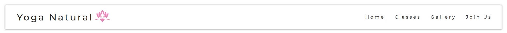

# Yoga Natural 

### Introduction
Yoga Natural is my first project ( Portfolio 1 ). It is a website designed to promote a yoga studio and it's classes for future and currently students. The main target are people who are interested in starting practicing yoga and people that already have experienced and are looking for advanced or specific classes to continue to improve.

[Live Webpage!](https://danielterceiro.github.io/Yoga-Natural/):earth_americas:

## UX
My primary goal was to ensure that oth new users and experienced users on yoga practice would be confortable using the website across differents types os screen and devices all while enjoying a clean and minimalist design focusing on soft colors and not overwhelming the users with unnecessary information.
The main colors used were purple, pink for logo, black for text and white for background to bring a calm and relaxing website.

### Target Audience
* Users new to Yoga.
* Users already experienced in Yoga practice.
* Users interested in wellness and wellbeing and health lifestyle in general.

### First Time Users
* As a user, I'm looking to find out about yoga classes and its diferences.
* As a first time visitor I need to be able to understand, navigate and find what i'm looking easily.
* As a user  I want to be able to reach out and ask questions if needed.
* As a first time user I want to be able to see pictures of the place ad the classes.

### Returning Users
* As a returning user I want to be able to find the classes that interested me.
* As a returning user I want to know all classes available and the differences between each.
* As a returning user I want to be able to contact the studio if necessary.

### Frequent Users
* Frequent users would have the same needs as a returning user.

## Wireframes
I designed the wireframes on Balsamiq, below I linked the folder with my wireframes, I kept it simple, as a low fidelity wireframes to be used as a guide for the design of the website, but in general I kept the same format as it was straight forward what I had in mind for a easy to use and understand website, no complications or unecessary information.

[Wireframes Project 1](https://github.com/DanielTerceiro/Yoga-Natural/tree/main/assets/doc-readme/wireframes)

## UI
### Color Scheme
I wanted a color scheme simple and relaxing, thus using for all pages:
* purple (#7b6cd5) for nav bar selected, sub-titles and footer
* red-magenta (#e88bba) for the logo
* black (#000000) for paragrah text 
* off-white (#fafafa) for itens over other colors and background

All colors were selected from [Coolors](https://coolors.co/)

### Typography

Following the same principle on the color schema, I wanted to keep it simple, efficient and able to run on any type of browser old or new, so using google fonts was the best option and font that are common use:

* **Montserrat** - was my choice of use for the versatilite to be able to be used as header and paragraph and for being open source.

## Features
* All pages are responsive
* The header and footer remain the same across all pages on all sizes - mantaining the facility to navigate back and forth

  **Header**

  **Footer**

### Visual
* **Homepage - Desktop** 
For the homepage my goal was to have a hero image covering the whole width of the screen and leading to a section describing the advantages of each yoga type and below all classes available for customers.

* **Classes - Desktop** 
The Classes page have the sole purpose to show the day, hours and type of classes available, with no unnecessary information

* **Gallery - Desktop** 
The Gallery page was created with the idea to give the customer an idea of the studio and the classes, a way to vizualize the experience

* **Join Us - Desktop** 
The Join Us page have a simple form were the customer can get in touch to get answers relevant to the classes

### Features to implement in the future
* In the future the first plan is to add a dedicated page for the instructors linked to what classes they provide
* After would be a specific page for videos, tutorials and tips related to yoga dn wellbeing
* A map with the location under the form for contact ( altought it is not included at the moment because there's no real location)
	
## Technologies Used
Below is everything that I used throughout development for the building of the website:

* [HTML](https://en.wikipedia.org/wiki/HTML5) - HTMl5 provided the content and the structure of my website.
* [CSS](https://en.wikipedia.org/wiki/CSS) - To provide style to all pages.
* [Google Fonts](https://fonts.google.com/)- Google fonts was used for the Font used.
* [Balsamiq](https://balsamiq.com/) - For the creation of my wireframes
* [Coolors](https://coolors.co/) - For color pallete used on the website
* [Gitpod](https://gitpod.io/workspaces) - All code was created through Gitpod and the workspace for this project resides there.
* [Github](https://github.com/) - For externally hold the repository and deploy the website. 
* [W3C Markup Validation Service](https://validator.w3.org/) - Used to check my HTML code
* [CSS Validation Service](https://jigsaw.w3.org/css-validator/) - Used to check my CSS code

	
## Testing
I ran all my code through the [W3C Markup Validation Service](https://validator.w3.org/) and the [CSS Validation Service](https://jigsaw.w3.org/css-validator/).
Both pointed me on a few errors that I was capable of solving as: 
* More than one use of "H1"
* Some images with low contrast to the background
* Unnecessary closing tag
* Parse error on CSS code due to unclosed tag. 

Link for the result of the test with the errors fixed: 
[CSS](https://github.com/DanielTerceiro/Yoga-Natural/blob/main/assets/doc-readme/css-validator/css.jpg) 
[Homepage](https://github.com/DanielTerceiro/Yoga-Natural/blob/main/assets/doc-readme/html-validator/index.jpg) 
[Classes](https://github.com/DanielTerceiro/Yoga-Natural/blob/main/assets/doc-readme/html-validator/classes.jpg) 
[Gallery](https://github.com/DanielTerceiro/Yoga-Natural/blob/main/assets/doc-readme/html-validator/gallery.jpg) 
[Join Us](https://github.com/DanielTerceiro/Yoga-Natural/blob/main/assets/doc-readme/html-validator/joinus.jpg) 

### GTMetrix

This website has been tested through the GTMetrix site, GTmetrix. Below is a screenshot of the results achieved. Page performance was 100% and the time to fully load the site was 0.6s.

### Lighthouse

Tested on desktop and mobile

**Desktop**

**Mobile**

## Bugs
During the process of creating the website I enconter some bugs and issues:

* The first one was on the footer not sticking to the botton when the screen switched from desktop to tablet or mobile - 
The solution: was to removed the fixed size of the body on the media querys, allowing the fotter to stay below all section when all elements moved down.

* The second one was the circular image on the homepage below the Hero image, was not responsive and breaking the flow of the page on mobile screen
The solution: it was fixed by giving a different value on differents breakpoints allowing it to follow the positioning of the others elements

* And third was the table for the classes time on the Classes page, due to it not being able to break on more lines and allow to fit on screen below 300px 
The Solution: I decided to change the layout so it could be used the same way on all screens size.

## Deployment

I deployed the page on GitHub pages via the following procedure:
* Go to https://github.com and login
* Navigate to the required repository: Yoga-Natural
* Go to settings 
* Go down to "GitHub Pages"
* Select the source (I chose master branch )
* After a brief time, a message will apper as "Your site is published at..."

## Credits

### Gereral Reference
* The Love Running project walktrought as base for my project and general guidance
 
* For general advice and techniques to solve daily issues [W3 Schools](https://w3schools.com)

* CI Slack Community for helping with day-to-day questions 

* All Medias (open source) extracted from [Pexels](https://pexels.com)

* Icons in the footer were taken from [Fonts Awesome](https://fontawesome.com)

* Fonts from [Google Fonts](https://fonts.google.com/)
